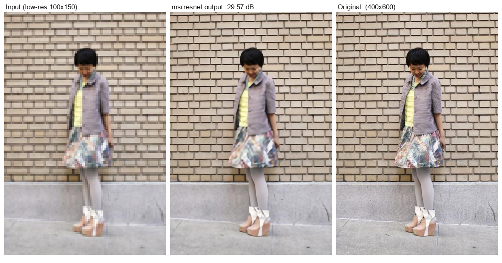
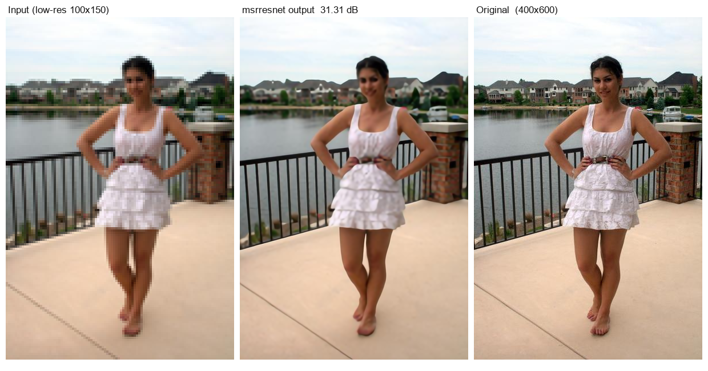
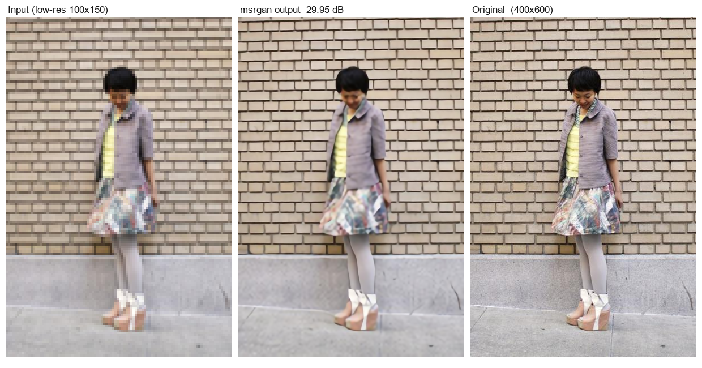
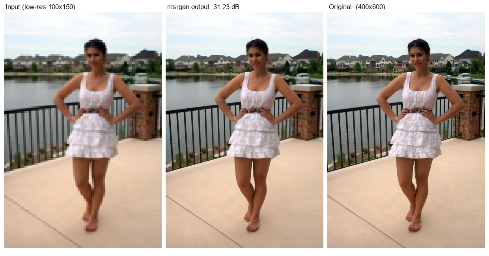

# Super Resolution

Single-image super-resolution at 4x upscaling. Several architectures are fine-tuned on
the same dataset with the same budget and evaluated under one protocol, so the numbers
sit in a single comparable table.

*A demonstration / portfolio project.*

---

## Results

50 held-out test images, x4 upscaling, PSNR and SSIM on the Y (luma) channel with a
4-pixel border crop — the standard protocol in the super-resolution literature.

| Method | PSNR (dB) | SSIM | Type |
|---|---:|---:|---|
| Nearest neighbour | 25.21 | 0.8235 | classical |
| Bilinear | 25.89 | 0.8272 | classical |
| Bicubic | 26.38 | 0.8468 | classical (reference) |
| Lanczos | 26.57 | 0.8538 | classical |
| **MSRResNet (fine-tuned)** | **28.55** | 0.8945 | learned |
| **MSRGAN (fine-tuned)** | **28.50** | 0.8938 | learned |

**+2.17 dB over bicubic.** Classical interpolation is included as the reference because
a learned model is only worth its weights if it beats what `Image.resize` gives for
free.

---

## Sample output

Two examples per model, chosen from ten by the largest PSNR gain over bicubic
interpolation — that selects the images where the model contributes most, rather than
the images that are simply easiest.

### MSRResNet





### MSRGAN





Each panel is **input (low-resolution) → model output → original**. The input is the
actual 100x150 image the network receives, shown at display size.

---

## Models

| Model | Params | Architecture | Loss |
|---|---:|---|---|
| MSRResNet | 1.52 M | 16-block SRResNet | L1 |
| MSRGAN | 1.52 M | 16-block SRResNet | L1 |

Both start from published checkpoints and are fine-tuned on this dataset.

More models are being added to this repository — the evaluation protocol and dataset are
held fixed so every entry lands in the same table.

---

## Dataset

1,000 photographs, split 800 / 150 / 50 (train / val / test).

Images were filtered for sharpness before use: a soft high-resolution target teaches the
model to produce soft output, so candidates were scored by how much real detail a 2x
downscale/upscale round trip destroys, measured on edge pixels only. 104 of 1,104
candidates were rejected.

Low-resolution inputs are produced by bicubic downsampling, and the same protocol is
applied to every method in the table.

---

## Training

Hyperparameters are derived from the dataset rather than copied from the reference
configurations, which were written for different dataset sizes and GPU counts. The
quantity that transfers is the number of gradient updates:

```
steps = epochs x N_train / batch
```

| Setting | Value |
|---|---|
| Steps | 20,000 |
| Batch size | 32 |
| Optimiser | Adam (0.9, 0.99) |
| Learning rate | 1e-4, cosine decay |
| Patch size | 128 |
| Augmentation | random crop, horizontal flip |
| Seed | 3407 |

Batch size was chosen by measuring throughput rather than by convention.

The learning rate is adjusted automatically during training: validation PSNR is checked
every 5 epochs, and the rate is raised if progress has slowed while the metric is still
improving, or lowered if it has started to fall. Training stops early once the metric
has been flat for three consecutive checks.

---

## Usage

```bash
# classical baselines
python baseline_classical.py

# published checkpoints, no training
python eval_pretrained.py

# fine-tune one model
python train_sr.py --model msrresnet --steps 20000 --bs 32 --lr 1e-4

# inference panels
python make_showcase.py
```

Training resumes from the last checkpoint with `--resume`, restoring optimiser and
scheduler state alongside the weights.

---

## Repository layout

```
models/<name>/      sample outputs + training_results.json
benchmarks/         classical baselines, zero-shot evaluations
train_sr.py         training
baseline_classical.py, eval_pretrained.py, make_showcase.py
```

`training_results.json` holds the full per-checkpoint history, final train/val/test
metrics, and the exact arguments used.

---

## Notes on the metrics

PSNR and SSIM measure pixel accuracy. They are the standard for this task and are
reported here for comparability with published work, but they reward pixel-wise
agreement rather than perceptual sharpness — two models with similar PSNR can look
noticeably different. The sample images are included so the output can be judged
directly.

---

## Acknowledgements

Architectures and pretrained weights from [BasicSR](https://github.com/XPixelGroup/BasicSR)
and [Real-ESRGAN](https://github.com/xinntao/Real-ESRGAN) by Xintao Wang et al.
